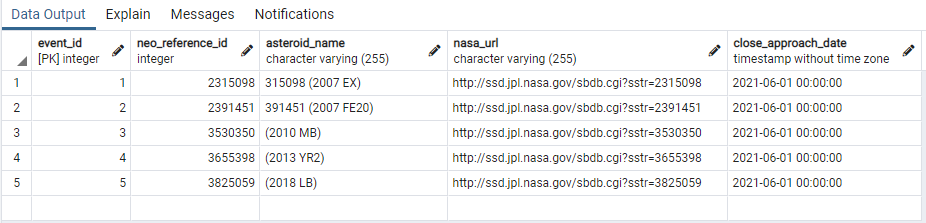
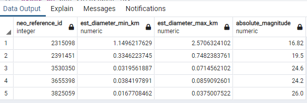
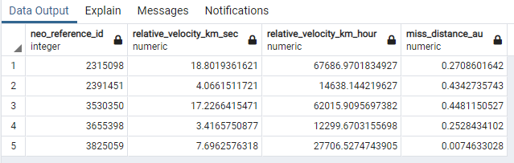
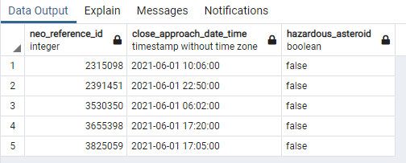

# ETL-Project_15

## Extracting json data from API
* We have extracted json data 
## Data Transformation
* We used a Pandas functions in Jupyter Notebook to transform API request responses into dataframes.
* We used a python transformation functions for data cleaning,filtering.
* Duplicate rows was removed, and successfully managed.

## Close Approach Dataset
NASA's Center for Near-Earth Object Studies (CNEOS) also provides data about close approaches of NEOs to Earth. A close approach occurs when an NEO's orbit path brings it near Earth - although, "near" in astronomical terms can be quite far in human-scale units, such as kilometers. Instead of kilometers, astronomical distances within the solar system are often measured with the astronomical unit (au) - the mean distance between the Earth and the sun - although sometimes you'll see distances measured with the lunar distance (ld) - the mean distance between the Earth and the moon - or even plain old kilometers.

From this dataset, you can answer questions such as "On which date(s) does Halley's Comet pass near to Earth?" or "How fast does Eros pass by Earth, on average?"
* We did inspect the properties of the near-Earth objects in the data set and query the data set using any combination of the following filters:
Occurs on a given date.
Occurs on or after a given start date.
Occurs on or before a given end date.
Approaches Earth at a distance of at least (or at most) X astronomical units.
Approaches Earth at a relative velocity of at least (or at most) Y kilometers per second.
Has a diameter that is at least as large as (or at least as small as) Z kilometers.
Is marked by NASA as potentially hazardous (or not).
How many NEOs are in the neos.csv data set?
Hint: Count the number of rows in the neos.csv file.
Answer: 23967
What is the primary designation of the first Near Earth Object in the neos.csv data set?
Hint: Look at the first row of the CSV, under the header "pdes"
Answer: 433
What is the diameter of the NEO whose name is "Apollo"?
Hint: Look for the row of the CSV containing the name "Apollo" in the "name" column, and find the entry under the "diameter" column.
Answer: 1.5 kilometers
How many NEOs have IAU names in the data set?
Hint: Count the number of rows that have nonempty entries in the "name" column.
Answer: 343
How many NEOs have diameters in the data set?
Hint: Count the number of rows that have nonempty entries in the "diameter" column.
Answer: 1268
How many close approaches are in the cad.json data set?
Hint: Instead of manually counting the entries, you can use the value of the "count" key.
Answer: 406785
On January 1st, 2000, how close did the NEO whose primary designation is "2015 CL" pass by Earth?
Find entries whose date starts with '2000-Jan-01'. One of the lists represents the close approach of the NEO "2015 CL". What is the value corresponding to the distance from Earth?
Answer: About 0.145 au
On January 1st, 2000, how fast did the NEO whose primary designation is "2002 PB" pass by Earth?
Hint: Find entries whose date starts with '2000-Jan-01'. One of the lists represents the close approach of the NEO "2002 PB". What is the value corresponding to the velocity relative to Earth?
Answer: About 29.39 km/s
## Visual Exploration

#### asteroid details table

#### asteroid_size table

#### asteroid_speed table

#### hazardous_asteroid table

